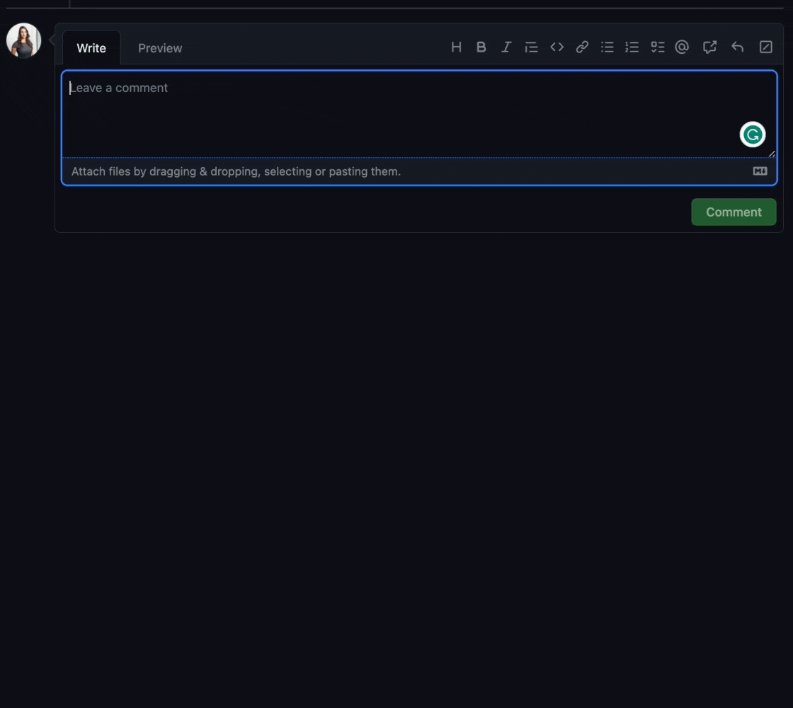
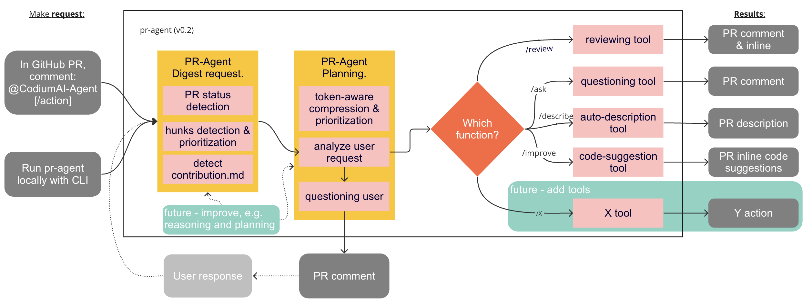

<div align="center">

<div align="center">


</div>

[](https://github.com/Codium-ai/pr-agent/blob/main/LICENSE)
[](https://discord.com/channels/1057273017547378788/1126104260430528613)

CodiumAI `pr-agent` is an open-source tool aiming to help developers review PRs faster and more efficiently. It automatically analyzes the PR, provides feedback and suggestions, and can answer free-text questions.

</div>

- [Live demo](#live-demo)
- [Quickstart](#Quickstart)
- [Usage and tools](#usage-and-tools)
- [Configuration](#Configuration)
- [How it works](#how-it-works)
- [Roadmap](#roadmap)
- [Similar projects](#similar-projects)

## Live demo

Experience GPT-4 powered PR review on your public GitHub repository with our hosted pr-agent. To try it, just mention `@CodiumAI-Agent` in any PR comment! The agent will generate a PR review in response.



To set up your own pr-agent, see the [Quickstart](#Quickstart) section

---

## Quickstart

To get started with pr-agent quickly, you first need to acquire two tokens:

1. An OpenAI key from [here](https://platform.openai.com/), with access to GPT-4.
2. A GitHub personal access token (classic) with the repo scope.

There are several ways to use pr-agent. Let's start with the simplest one:

---

#### Method 1: Use Docker image (no installation required)

To request a review for a PR, or ask a question about a PR, you can run directly from the Docker image. Here's how:

1. To request a review for a PR, run the following command:

```
docker run --rm -it -e OPENAI.KEY=<your key> -e GITHUB.USER_TOKEN=<your token> codiumai/pr-agent --pr_url <pr url>
```

2. To ask a question about a PR, run the following command:

```
docker run --rm -it -e OPENAI.KEY=<your key> -e GITHUB.USER_TOKEN=<your token> codiumai/pr-agent --pr_url <pr url> --question "<your question>"
```

Possible questions you can ask include:

- What is the main theme of this PR?
- Is the PR ready for merge?
- What are the main changes in this PR?
- Should this PR be split into smaller parts?
- Can you compose a rhymed song about this PR.

---

#### Method 2: Run from source

1. Clone this repository:

```
git clone https://github.com/Codium-ai/pr-agent.git
```

2. Install the requirements in your favorite virtual environment:

```
pip install -r requirements.txt
```

3. Copy the secrets template file and fill in your OpenAI key and your GitHub user token:

```
cp pr_agent/settings/.secrets_template.toml pr_agent/settings/.secrets.toml
# Edit .secrets.toml file
```

4. Run the appropriate Python scripts from the scripts folder:

```
python pr_agent/cli.py --pr_url <pr url>
python pr_agent/cli.py --pr_url <pr url> --question "<your question>"
```

---

#### Method 3: Method 3: Run as a polling server; request reviews by tagging your Github user on a PR

Follow steps 1-3 of method 2.
Run the following command to start the server:

```
python pr_agent/servers/github_polling.py
```

---

#### Method 4: Run as a Github App, allowing you to automate the review process on your private or public repositories.

1. Create a GitHub App from the [Github Developer Portal](https://docs.github.com/en/developers/apps/creating-a-github-app).

   - Set the following permissions:
     - Pull requests: Read & write
     - Issue comment: Read & write
     - Metadata: Read-only
   - Set the following events:
     - Issue comment
     - Pull request

2. Generate a random secret for your app, and save it for later. For example, you can use:

```
WEBHOOK_SECRET=$(python -c "import secrets; print(secrets.token_hex(10))")
```

3. Acquire the following pieces of information from your app's settings page:

   - App private key (click "Generate a private key", and save the file)
   - App ID

4. Clone this repository:

```
git clone https://github.com/Codium-ai/pr-agent.git
```

5. Copy the secrets template file and fill in the following:
   - Your OpenAI key.
   - Set deployment_type to 'app'
   - Copy your app's private key to the private_key field.
   - Copy your app's ID to the app_id field.
   - Copy your app's webhook secret to the webhook_secret field.

```
cp pr_agent/settings/.secrets_template.toml pr_agent/settings/.secrets.toml
# Edit .secrets.toml file
```

6. Build a Docker image for the app and optionally push it to a Docker repository. We'll use Dockerhub as an example:

```
docker build . -t codiumai/pr-agent:github_app --target github_app -f docker/Dockerfile
docker push codiumai/pr-agent:github_app  # Push to your Docker repository
```

7. Host the app using a server, serverless function, or container environment. Alternatively, for development and
   debugging, you may use tools like smee.io to forward webhooks to your local machine.

8. Go back to your app's settings, set the following:

   - Webhook URL: The URL of your app's server, or the URL of the smee.io channel.
   - Webhook secret: The secret you generated earlier.

9. Install the app by navigating to the "Install App" tab, and selecting your desired repositories.

---

## Usage and Tools

CodiumAI pr-agent provides two types of interactions ("tools"): `"PR Reviewer"` and `"PR Q&A"`.

- The "PR Reviewer" tool automatically analyzes PRs, and provides different types of feedbacks.
- The "PR Q&A" tool answers free-text questions about the PR.

### PR Reviewer

Here is a quick overview of the different sub-tools of PR Reviewer:

- PR Analysis
  - Summarize main theme
  - PR type classification
  - Is the PR covered by relevant tests
  - Is this a focused PR
  - Are there security concerns
- PR Feedback
  - General PR suggestions
  - Code suggestions

This is how a typical output of the PR Reviewer looks like:

---

#### PR Analysis

- 🎯 **Main theme:** Adding language extension handler and token handler
- 📌 **Type of PR:** Enhancement
- 🧪 **Relevant tests added:** No
- ✨ **Focused PR:** Yes, the PR is focused on adding two new handlers for language extension and token counting.
- 🔒 **Security concerns:** No, the PR does not introduce possible security concerns or issues.

#### PR Feedback

- 💡 **General PR suggestions:** The PR is generally well-structured and the code is clean. However, it would be beneficial to add some tests to ensure the new handlers work as expected. Also, consider adding docstrings to the new functions and classes to improve code readability and maintainability.

- 🤖 **Code suggestions:**

  - **relevant file:** pr_agent/algo/language_handler.py

    **suggestion content:** Consider using a set instead of a list for 'bad_extensions' as checking membership in a set is faster than in a list. [medium]

  - **relevant file:** pr_agent/algo/language_handler.py

    **suggestion content:** In the 'filter_bad_extensions' function, you are splitting the filename on '.' and taking the last element to get the extension. This might not work as expected if the filename contains multiple '.' characters. Consider using 'os.path.splitext' to get the file extension more reliably. [important]

---

### PR Q&A

This tool answers free-text questions about the PR. This is how a typical output of the PR Q&A looks like:

**Question**: summarize for me the PR in 4 bullet points

**Answer**:

- The PR introduces a new feature to sort files by their main languages. It uses a mapping of programming languages to their file extensions to achieve this.
- It also introduces a filter to exclude files with certain extensions, deemed as 'bad extensions', from the sorting process.
- The PR modifies the `get_pr_diff` function in `pr_processing.py` to use the new sorting function. It also refactors the code to move the PR pruning logic into a separate function.
- A new `TokenHandler` class is introduced in `token_handler.py` to handle token counting operations. This class is initialized with a PR, variables, system, and user, and provides methods to get system and user tokens and to count tokens in a patch.

---

## Configuration

The different tools and sub-tools used by CodiumAI pr-agent are easily configurable via the configuration file: `/settings/configuration.toml`.

#### Enabling/disabling sub-tools:

You can enable/disable the different PR Reviewer sub-sections with the following flags:

```
require_focused_review=true
require_tests_review=true
require_security_review=true
```

## How it works



Check out the [PR Compression strategy](./PR_COMPRESSION.md) page for more details on how we convert a code diff to a manageable LLM prompt

## Roadmap

- [ ] Support open-source models, as a replacement for openai models. Note that a minimal requirement for each open-source model is to have 8k+ context, and good support for generating json as an output
- [ ] Support other Git providers, such as Gitlab and Bitbucket.
- [ ] Develop additional logics for handling large PRs, and compressing git patches
- [ ] Dedicated tools and sub-tools for specific programming languages (Python, Javascript, Java, C++, etc)
- [ ] Add additional context to the prompt. For example, repo (or relevant files) summarization, with tools such a [ctags](https://github.com/universal-ctags/ctags)
- [ ] Adding more tools. Possible directions:
  - [ ] Code Quality
  - [ ] Coding Style
  - [ ] Performance (are there any performance issues)
  - [ ] Documentation (is the PR properly documented)
  - [ ] Rank the PR importance
  - [ ] ...

## Similar Projects

- [CodiumAI - Meaningful tests for busy devs](https://github.com/Codium-ai/codiumai-vscode-release)
- [Aider - GPT powered coding in your terminal](https://github.com/paul-gauthier/aider)
- [GPT-Engineer](https://github.com/AntonOsika/gpt-engineer)
- [CodeReview BOT](https://github.com/anc95/ChatGPT-CodeReview)
- [AI-Maintainer](https://github.com/merwanehamadi/AI-Maintainer)
