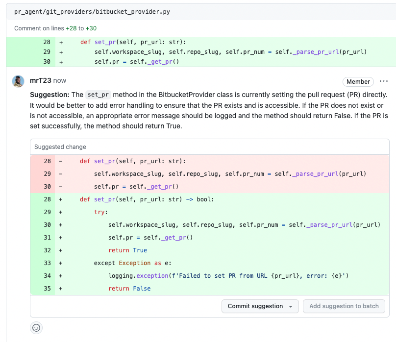

<div align="center">

<div align="center">


</div>

[](https://github.com/Codium-ai/pr-agent/blob/main/LICENSE)
[](https://discord.com/channels/1057273017547378788/1126104260430528613)
</div>
<div style="text-align:left;">

CodiumAI `PR-Agent` is an open-source tool aiming to help developers review PRs faster and more efficiently. It automatically analyzes the PR and can provide several types of feedback:

**Auto-Description**: Automatically generating PR description - name, type, summary, and code walkthrough.
\
**PR Review**: Feedback about the PR main theme, type, relevant tests, security issues, focused PR, and various suggestions for the PR content.
\
**Question Answering**: Answering free-text questions about the PR.
\
**Code Suggestion**: Committable code suggestions for improving the PR.

<h3>Example results:</h2>
</div>
<h4>Describe:</h4>
<div align="center">
<p float="center">

</p>
</div>
<h4>Review:</h4>
<div align="center">
<p float="center">

</p>
</div>
<h4>Ask:</h4>
<div align="center">
<p float="center">

</p>
</div>
<h4>Improve:</h4>
<div align="center">
<p float="center">

</p>
</div>
<div align="left">

- [Live demo](#live-demo)
- [Overview](#overview)
- [Quickstart](#quickstart)
- [Usage and tools](#usage-and-tools)
- [Configuration](./CONFIGURATION.md)
- [How it works](#how-it-works)
- [Roadmap](#roadmap)
- [Similar projects](#similar-projects)
</div>

## Live demo

Experience GPT-4 powered PR review on your public GitHub repository with our hosted PR-Agent. To try it, just mention `@CodiumAI-Agent` in any PR comment! The agent will generate a PR review in response.


To set up your own PR-Agent, see the [Quickstart](#Quickstart) section

---
## Overview
`PR-Agent` offers extensive pull request functionalities across various git providers:
|       |                                             | Github | Gitlab | Bitbucket |
|-------|---------------------------------------------|--------|--------|-----------|
| TOOLS | Review                                      | ✓      | ✓      | ✓         |
|       | ⮑ Inline review                             | ✓     | ✓      |           |
|       | Ask                                         | ✓      | ✓      |           |
|       | Auto-Description                            | ✓      |        |           |
|       | Improve Code                                | ✓      |        |           |
|       |                                             |        |        |           |
| USAGE | CLI                                         | ✓      | ✓      | ✓         |
|       | Tagging bot                                 | ✓      | ✓      |           |
|       | Actions                                     | ✓      |        |           |
|       |                                             |        |        |           |
| CORE  | PR compression                              | ✓      | ✓      | ✓         |
|       | Repo language prioritization                | ✓      | ✓      | ✓         |
|       | Adaptive and token-aware<br />file patch fitting | ✓      | ✓      | ✓         |

Examples for invoking the different tools via the [CLI](#quickstart):
- **Review**:       python cli.py --pr-url=<pr_url>  review
- **Describe**:     python cli.py --pr-url=<pr_url>  describe
- **Improve**:      python cli.py --pr-url=<pr_url>  improve
- **Ask**:          python cli.py --pr-url=<pr_url>  ask "Write me a poem about this PR"

"<pr_url>" is the url of the relevant PR (for example: https://github.com/Codium-ai/pr-agent/pull/50).

In the [configuration](./CONFIGURATION.md) file you can select your git provider (Github, Gitlab, Bitbucket), and further configure the different tools.

## Quickstart

To get started with PR-Agent quickly, you first need to acquire two tokens:

1. An OpenAI key from [here](https://platform.openai.com/), with access to GPT-4.
2. A GitHub personal access token (classic) with the repo scope.

There are several ways to use PR-Agent. Let's start with the simplest one:

---

#### Method 1: Use Docker image (no installation required)

To request a review for a PR, or ask a question about a PR, you can run directly from the Docker image. Here's how:

1. To request a review for a PR, run the following command:

```
docker run --rm -it -e OPENAI.KEY=<your key> -e GITHUB.USER_TOKEN=<your token> codiumai/pr-agent --pr_url <pr_url> review
```

2. To ask a question about a PR, run the following command:

```
docker run --rm -it -e OPENAI.KEY=<your key> -e GITHUB.USER_TOKEN=<your token> codiumai/pr-agent --pr_url <pr_url> ask "<your question>"
```

Possible questions you can ask include:

- What is the main theme of this PR?
- Is the PR ready for merge?
- What are the main changes in this PR?
- Should this PR be split into smaller parts?
- Can you compose a rhymed song about this PR?

---

#### Method 2: Run as a GitHub Action

You can use our pre-built Github Action Docker image to run PR-Agent as a Github Action. 

1. Add the following file to your repository under `.github/workflows/pr_agent.yml`:

```yaml
on:
  pull_request:
  issue_comment:
jobs:
  pr_agent_job:
    runs-on: ubuntu-latest
    name: Run pr agent on every pull request, respond to user comments
    steps:
      - name: PR Agent action step
        id: pragent
        uses: Codium-ai/pr-agent@main
        env:
          OPENAI_KEY: ${{ secrets.OPENAI_KEY }}
          GITHUB_TOKEN: ${{ secrets.GITHUB_TOKEN }}
```

2. Add the following secret to your repository under `Settings > Secrets`:

```
OPENAI_KEY: <your key>
```

The GITHUB_TOKEN secret is automatically created by GitHub.

3. Merge this change to your main branch. 
When you open your next PR, you should see a comment from `github-actions` bot with a review of your PR, and instructions on how to use the rest of the tools.

4. You may configure PR-Agent by adding environment variables under the env section corresponding to any configurable property in the [configuration](./CONFIGURATION.md) file. Some examples:
```yaml
      env:
        # ... previous environment values
        OPENAI.ORG: "<Your organization name under your OpenAI account>"
        PR_REVIEWER.REQUIRE_TESTS_REVIEW: "false" # Disable tests review
        PR_CODE_SUGGESTIONS.NUM_CODE_SUGGESTIONS: 6 # Increase number of code suggestions
```

---

#### Method 3: Run from source

1. Clone this repository:

```
git clone https://github.com/Codium-ai/pr-agent.git
```

2. Install the requirements in your favorite virtual environment:

```
pip install -r requirements.txt
```

3. Copy the secrets template file and fill in your OpenAI key and your GitHub user token:

```
cp pr_agent/settings/.secrets_template.toml pr_agent/settings/.secrets.toml
# Edit .secrets.toml file
```

4. Run the appropriate Python scripts from the scripts folder:

```
python pr_agent/cli.py --pr_url <pr_url> review
python pr_agent/cli.py --pr_url <pr_url> ask <your question>
python pr_agent/cli.py --pr_url <pr_url> describe
python pr_agent/cli.py --pr_url <pr_url> improve
```

---

#### Method 4: Run as a polling server; request reviews by tagging your Github user on a PR

Follow steps 1-3 of method 2.
Run the following command to start the server:

```
python pr_agent/servers/github_polling.py
```

---

#### Method 5: Run as a GitHub App, allowing you to automate the review process on your private or public repositories.

1. Create a GitHub App from the [Github Developer Portal](https://docs.github.com/en/developers/apps/creating-a-github-app).

   - Set the following permissions:
     - Pull requests: Read & write
     - Issue comment: Read & write
     - Metadata: Read-only
   - Set the following events:
     - Issue comment
     - Pull request

2. Generate a random secret for your app, and save it for later. For example, you can use:

```
WEBHOOK_SECRET=$(python -c "import secrets; print(secrets.token_hex(10))")
```

3. Acquire the following pieces of information from your app's settings page:

   - App private key (click "Generate a private key" and save the file)
   - App ID

4. Clone this repository:

```
git clone https://github.com/Codium-ai/pr-agent.git
```

5. Copy the secrets template file and fill in the following:
   - Your OpenAI key.
   - Set deployment_type to 'app'
   - Copy your app's private key to the private_key field.
   - Copy your app's ID to the app_id field.
   - Copy your app's webhook secret to the webhook_secret field.

```
cp pr_agent/settings/.secrets_template.toml pr_agent/settings/.secrets.toml
# Edit .secrets.toml file
```

6. Build a Docker image for the app and optionally push it to a Docker repository. We'll use Dockerhub as an example:

```
docker build . -t codiumai/pr-agent:github_app --target github_app -f docker/Dockerfile
docker push codiumai/pr-agent:github_app  # Push to your Docker repository
```

7. Host the app using a server, serverless function, or container environment. Alternatively, for development and
   debugging, you may use tools like smee.io to forward webhooks to your local machine.

8. Go back to your app's settings, and set the following:

   - Webhook URL: The URL of your app's server or the URL of the smee.io channel.
   - Webhook secret: The secret you generated earlier.

9. Install the app by navigating to the "Install App" tab and selecting your desired repositories.

---

## Usage and Tools

**PR-Agent** provides four types of interactions ("tools"): `"PR Reviewer"`, `"PR Q&A"`, `"PR Description"` and `"PR Code Sueggestions"`.

- The "PR Reviewer" tool automatically analyzes PRs, and provides different types of feedback.
- The "PR Ask" tool answers free-text questions about the PR.
- The "PR Description" tool automatically sets the PR Title and body.
- The "PR Code Suggestion" tool provide inline code suggestions for the PR that can be applied and committed.

## How it works


Check out the [PR Compression strategy](./PR_COMPRESSION.md) page for more details on how we convert a code diff to a manageable LLM prompt

## Roadmap

- [ ] Support open-source models, as a replacement for openai models. (Note - a minimal requirement for each open-source model is to have 8k+ context, and good support for generating json as an output)
- [x] Support other Git providers, such as Gitlab and Bitbucket.
- [ ] Develop additional logics for handling large PRs, and compressing git patches
- [ ] Dedicated tools and sub-tools for specific programming languages (Python, Javascript, Java, C++, etc)
- [ ] Add additional context to the prompt. For example, repo (or relevant files) summarization, with tools such a [ctags](https://github.com/universal-ctags/ctags)
- [ ] Adding more tools. Possible directions:
  - [x] PR description
  - [x] Inline code suggestions
  - [ ] Enforcing CONTRIBUTING.md guidelines
  - [ ] Performance (are there any performance issues)
  - [ ] Documentation (is the PR properly documented)
  - [ ] Rank the PR importance
  - [ ] ...

## Similar Projects

- [CodiumAI - Meaningful tests for busy devs](https://github.com/Codium-ai/codiumai-vscode-release)
- [Aider - GPT powered coding in your terminal](https://github.com/paul-gauthier/aider)
- [openai-pr-reviewer](https://github.com/coderabbitai/openai-pr-reviewer)
- [CodeReview BOT](https://github.com/anc95/ChatGPT-CodeReview)
- [AI-Maintainer](https://github.com/merwanehamadi/AI-Maintainer)
