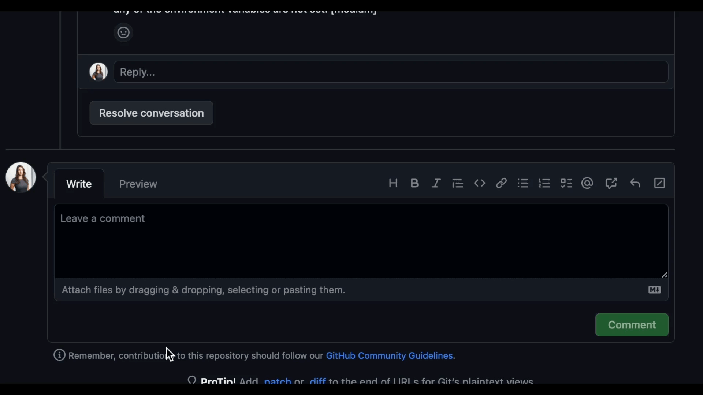

CodiumAI `PR-Agent` is an open-source tool aiming to help developers review PRs faster and more efficiently. It automatically analyzes the PR and can provide several types of feedback:

**Auto-Description**: Automatically generating PR description - name, type, summary, and code walkthrough.
\
**PR Review**: Feedback about the PR main theme, type, relevant tests, security issues, focused PR, and various suggestions for the PR content.
\
**Question Answering**: Answering free-text questions about the PR.
\
**Code Suggestion**: Committable code suggestions for improving the PR.

<h3>Example results:</h2>

<h4>Describe:</h4>

<h4>Review:</h4>

<h4>Ask:</h4>

<h4>Improve:</h4>

- [Live demo](#live-demo)
- [Overview](#overview)
- [Quickstart](#quickstart)
- [Usage and tools](#usage-and-tools)
- [Configuration](./CONFIGURATION.md)
- [How it works](#how-it-works)
- [Roadmap](#roadmap)
- [Similar projects](#similar-projects)

## Live demo

Experience GPT-4 powered PR review on your public GitHub repository with our hosted PR-Agent. To try it, just mention `@CodiumAI-Agent` in any PR comment! The agent will generate a PR review in response.

To set up your own PR-Agent, see the [Quickstart](#Quickstart) section

---
## Overview
`PR-Agent` offers extensive pull request functionalities across various git providers:
|       |                                             | Github | Gitlab | Bitbucket |
|-------|---------------------------------------------|--------|--------|-----------|
| TOOLS | Review                                      | ✓      | ✓      | ✓         |
|       | ⮑ Inline review                             | ✓     | ✓      |           |
|       | Ask                                         | ✓      | ✓      |           |
|       | Auto-Description                            | ✓      |        |           |
|       | Improve Code                                | ✓      |        |           |
|       |                                             |        |        |           |
| USAGE | CLI                                         | ✓      | ✓      | ✓         |
|       | Tagging bot                                 | ✓      | ✓      |           |
|       | Actions                                     | ✓      |        |           |
|       |                                             |        |        |           |
| CORE  | PR compression                              | ✓      | ✓      | ✓         |
|       | Repo language prioritization                | ✓      | ✓      | ✓         |
|       | Adaptive and token-aware file patch fitting | ✓      | ✓      | ✓         |

Examples for invoking the different tools via the [CLI](#quickstart):
- **Review**:       python cli.py --pr-url=<pr_url>  review
- **Describe**:     python cli.py --pr-url=<pr_url>  describe
- **Improve**:      python cli.py --pr-url=<pr_url>  improve
- **Ask**:          python cli.py --pr-url=<pr_url>  ask "Write me a poem about this PR"

"<pr_url>" is the url of the relevant PR (for example: https://github.com/Codium-ai/pr-agent/pull/50).

In the [configuration](./CONFIGURATION.md) file you can select your git provider (Github, Gitlab, Bitbucket), and further configure the different tools.

## Quickstart

To get started with PR-Agent quickly, you first need to acquire two tokens:

1. An OpenAI key from [here](https://platform.openai.com/), with access to GPT-4.
2. A GitHub personal access token (classic) with the repo scope.

There are several ways to use PR-Agent. Let's start with the simplest one:

## Install
Here are several ways to install and run PR-Agent:

- [Method 1: Use Docker image (no installation required)](INSTALL.md#method-1-use-docker-image-no-installation-required)
- [Method 2: Run as a Github Action](INSTALL.md#method-2-run-as-a-github-action)
- [Method 3: Run from source](INSTALL.md#method-3-run-from-source)
- [Method 4: Run as a polling server](INSTALL.md#method-4-run-as-a-polling-server)
  - Request reviews by tagging your Github user on a PR
- [Method 5: Run as a Github App](INSTALL.md#method-5-run-as-a-github-app)
  - Allowing you to automate the review process on your private or public repositories

## Usage and Tools

**PR-Agent** provides four types of interactions ("tools"): `"PR Reviewer"`, `"PR Q&A"`, `"PR Description"` and `"PR Code Sueggestions"`.

- The "PR Reviewer" tool automatically analyzes PRs, and provides different types of feedback.
- The "PR Ask" tool answers free-text questions about the PR.
- The "PR Description" tool automatically sets the PR Title and body.
- The "PR Code Suggestion" tool provide inline code suggestions for the PR that can be applied and committed.

## How it works

Check out the [PR Compression strategy](./PR_COMPRESSION.md) page for more details on how we convert a code diff to a manageable LLM prompt

## Roadmap

- [ ] Support open-source models, as a replacement for openai models. (Note - a minimal requirement for each open-source model is to have 8k+ context, and good support for generating json as an output)
- [x] Support other Git providers, such as Gitlab and Bitbucket.
- [ ] Develop additional logics for handling large PRs, and compressing git patches
- [ ] Dedicated tools and sub-tools for specific programming languages (Python, Javascript, Java, C++, etc)
- [ ] Add additional context to the prompt. For example, repo (or relevant files) summarization, with tools such a [ctags](https://github.com/universal-ctags/ctags)
- [ ] Adding more tools. Possible directions:
  - [x] PR description
  - [x] Inline code suggestions
  - [ ] Enforcing CONTRIBUTING.md guidelines
  - [ ] Performance (are there any performance issues)
  - [ ] Documentation (is the PR properly documented)
  - [ ] Rank the PR importance
  - [ ] ...

## Similar Projects

- [CodiumAI - Meaningful tests for busy devs](https://github.com/Codium-ai/codiumai-vscode-release)
- [Aider - GPT powered coding in your terminal](https://github.com/paul-gauthier/aider)
- [openai-pr-reviewer](https://github.com/coderabbitai/openai-pr-reviewer)
- [CodeReview BOT](https://github.com/anc95/ChatGPT-CodeReview)
- [AI-Maintainer](https://github.com/merwanehamadi/AI-Maintainer)
